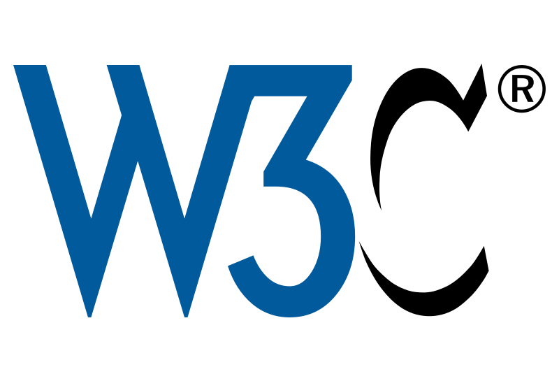

# W3C
World Wide Web Consortium

## Inhoudstafel
- [W3C](#w3c)
  - [Inhoudstafel](#inhoudstafel)
  - [Pagina's](#paginas)
    - [Het concept van W3C:](#het-concept-van-w3c)
    - [Hoe draagt W3C bij aan de functionaliteit van het internet?](#hoe-draagt-w3c-bij-aan-de-functionaliteit-van-het-internet)
- 
    - [Welke rol speelt W3C bij het waarborgen van de beveiliging van online communicatie?](#welke-rol-speelt-w3c-bij-het-waarborgen-van-de-beveiliging-van-online-communicatie)
    - [Welke data zou gestolen kunnen worden wanneer een hacker toegang krijgt tot dit protocol?](#welke-data-zou-gestolen-kunnen-worden-wanneer-een-hacker-toegang-krijgt-tot-dit-protocol)
- 
    - [Hoe kunnen webontwikkelaars bijdragen aan het werk van het W3C?](#hoe-kunnen-webontwikkelaars-bijdragen-aan-het-werk-van-het-w3c)
    - [Hoe kunnen webontwikkelaars profiteren van het werk van het W3C?](#hoe-kunnen-webontwikkelaars-profiteren-van-het-werk-van-het-w3c)
- 
      - [Bron:](#bron)
    - 
    
    

## Pagina's
- [Pagina 2](pagina2.md)
- [Pagina 3](pagina3.md)

### Het concept van W3C:

- Het World Wide Web Consortium (W3C) is een internationale organisatie die zich richt op het ontwikkelen en bevorderen van standaarden voor het World Wide Web. Deze standaarden omvatten protocollen, richtlijnen, specificaties en tools die ervoor zorgen dat het web uniform, toegankelijk en bruikbaar is voor iedereen, ongeacht de technische infrastructuur die wordt gebruikt.

### Hoe draagt W3C bij aan de functionaliteit van het internet?

- Toegankelijkheid: W3C zet zich in voor het bevorderen van een toegankelijk web, waarbij ze richtlijnen ontwikkelen om ervoor te zorgen dat webcontent bruikbaar is voor mensen met verschillende vaardigheden en behoeften, inclusief mensen met beperkingen. 

- W3C ontwikkelt en bevordert open standaarden voor webtechnologieën zoals HTML, CSS en JavaScript. Deze standaarden stellen webontwikkelaars in staat om consistent werkende en interoperabele webpagina's en webapplicaties te creëren. 

- Innovatie en Samenwerking: W3C fungeert als een platform voor innovatie en samenwerking tussen belanghebbenden in de webgemeenschap, waaronder webontwikkelaars, browserleveranciers, bedrijven en academici.

#

### Welke rol speelt W3C bij het waarborgen van de beveiliging van online communicatie?

- Ondersteuning van Veiligheid in Webstandaarden: W3C integreert beveiligingsfuncties en verbeteringen in bestaande en nieuwe webstandaarden. Dit omvat bijvoorbeeld het bevorderen van HTTPS als standaardprotocol voor webcommunicatie en het verbeteren van de beveiliging van web-API's.

- Samenwerking met Beveiligingsgemeenschap: W3C werkt samen met de bredere beveiligingsgemeenschap om kwetsbaarheden te identificeren en aan te pakken, en om nieuwe beveiligingsstandaarden te ontwikkelen die rekening houden met actuele bedreigingen en risico's op het internet.

- Bevordering van Best Practices: W3C bevordert best practices op het gebied van webbeveiliging door middel van richtlijnen en aanbevelingen voor webontwikkelaars en browserleveranciers. Dit omvat het adviseren van veilige ontwikkelingsmethoden, het implementeren van beveiligingsheaders en het vermijden van bekende kwetsbaarheden.

### Welke data zou gestolen kunnen worden wanneer een hacker toegang krijgt tot dit protocol?

- Inloggegevens: Als een aanvaller toegang krijgt tot communicatie die via HTTPS of TLS wordt verzonden, kunnen ze mogelijk inloggegevens onderscheppen, zoals gebruikersnamen en wachtwoorden. Dit kan leiden tot ongeautoriseerde toegang tot accounts en gevoelige informatie.

- Financiële gegevens: Bij online transacties kunnen financiële gegevens zoals creditcardnummers, bankrekeninginformatie en transactiegegevens worden gestolen. Dit kan leiden tot financieel misbruik en identiteitsdiefstal.

- Persoonlijke informatie: Gevoelige persoonlijke informatie zoals adresgegevens, geboortedata, socialezekerheidsnummers en medische gegevens kunnen worden buitgemaakt, wat kan leiden tot privacy-inbreuken en identiteitsdiefstal.

- Sessiecookies en authenticatietokens: Aanvallers kunnen sessiecookies of authenticatietokens onderscheppen om ongeautoriseerde toegang te krijgen tot sessies en accounts van gebruikers, waardoor ze de identiteit van de gebruiker kunnen aannemen.

#

### Hoe kunnen webontwikkelaars bijdragen aan het werk van het W3C?

- Actieve Deelname aan Werkgroepen: Webontwikkelaars kunnen deelnemen aan deze werkgroepen om hun expertise en inzichten te delen, problemen te bespreken en actief bij te dragen aan de ontwikkeling van nieuwe webtechnologieën.

- Feedback Geven op Conceptspecificaties: W3C publiceert conceptspecificaties voor nieuwe webstandaarden en nodigt de gemeenschap uit om feedback te geven. Webontwikkelaars kunnen deze concepten beoordelen, testen en feedback verstrekken om bij te dragen aan de verbetering en verfijning ervan voordat ze definitief worden vastgesteld.

- Bewustmaking over Webstandaarden: Webontwikkelaars kunnen bijdragen aan het vergroten van het bewustzijn over het belang van webstandaarden binnen de bredere ontwikkelaarsgemeenschap en bij hun collega's.

###  Hoe kunnen webontwikkelaars profiteren van het werk van het W3C?

- Verbeterde Veiligheid en Privacy: Door het gebruik van webstandaarden die zijn ontwikkeld met aandacht voor veiligheid en privacy, kunnen ontwikkelaars profiteren van een hoger niveau van beveiliging voor hun websites en applicaties. Standaardconforme implementaties van beveiligingsprotocollen zoals HTTPS en TLS helpen om gegevens te beschermen tegen onderschepping en manipulatie door kwaadwillende partijen.

- Betere Tools en Technologieën: W3C ontwikkelt en bevordert open standaarden voor webtechnologieën zoals HTML, CSS en JavaScript. Door deze standaarden te volgen en te gebruiken, kunnen webontwikkelaars profiteren van meer consistente en interoperabele tools en technologieën. Dit betekent dat ze minder tijd hoeven te besteden aan het oplossen van compatibiliteitsproblemen tussen verschillende browsers en apparaten, en zich meer kunnen concentreren op het ontwikkelen van hoogwaardige webapplicaties.
#

#### Bron:

- https://www.w3.org/
- https://en.wikipedia.org/wiki/World_Wide_Web_Consortium

###
| Sectie | Beschrijving |
| --- | --- |
| W3C | Hoofdsectie, bevat de inhoudstafel en een korte beschrijving van W3C |
| Pagina's | Subsectie, bevat links naar andere pagina's |
| Het concept van W3C | Subsectie, beschrijft het concept van W3C |
| Hoe draagt W3C bij aan de functionaliteit van het internet? | Subsectie, beschrijft hoe W3C bijdraagt aan de functionaliteit van het internet |

